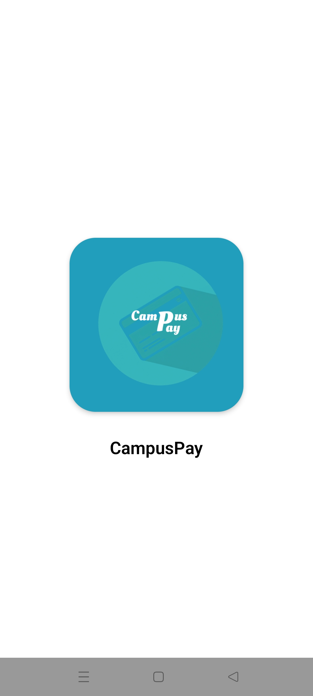
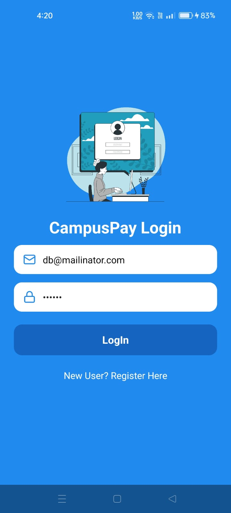
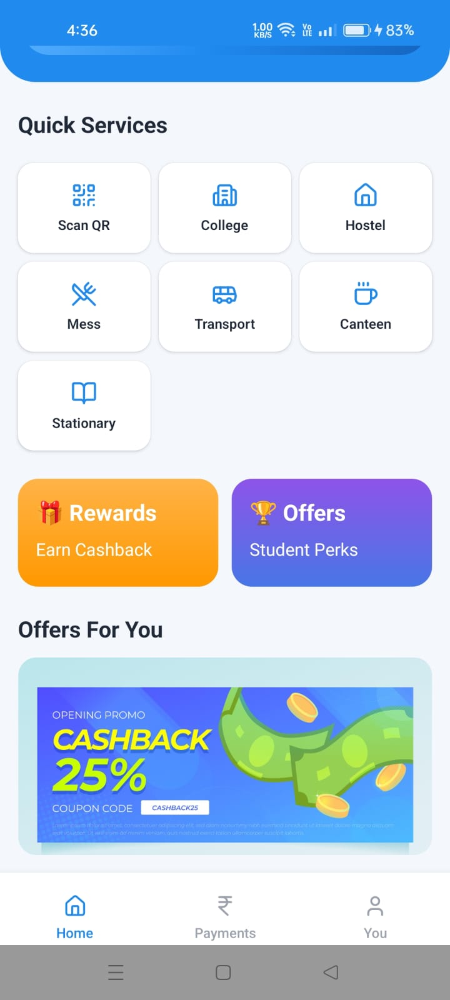
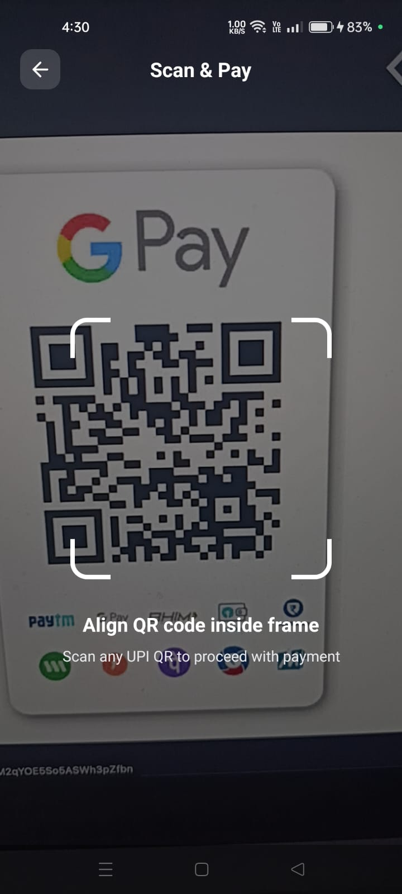
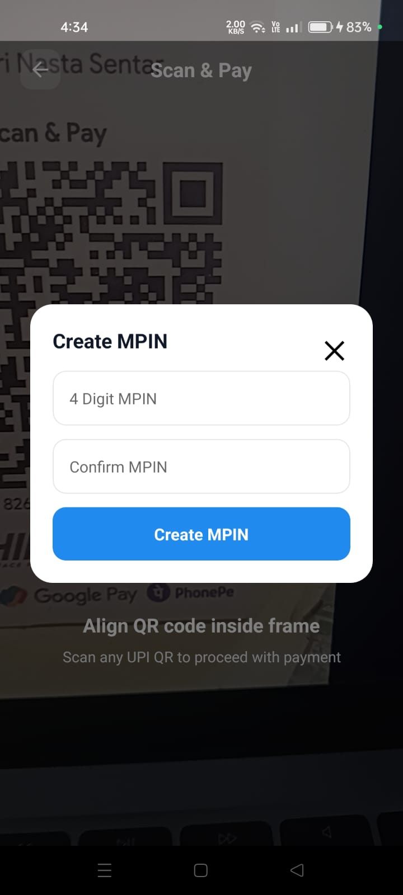
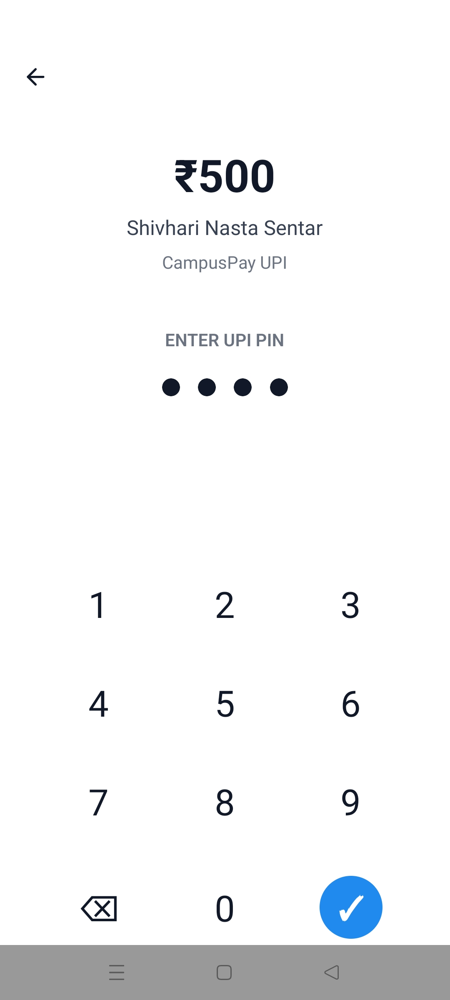
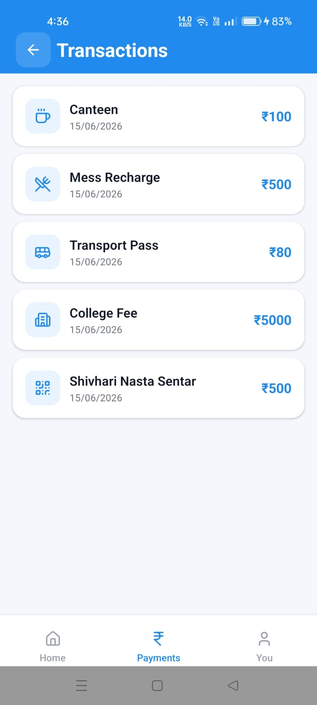
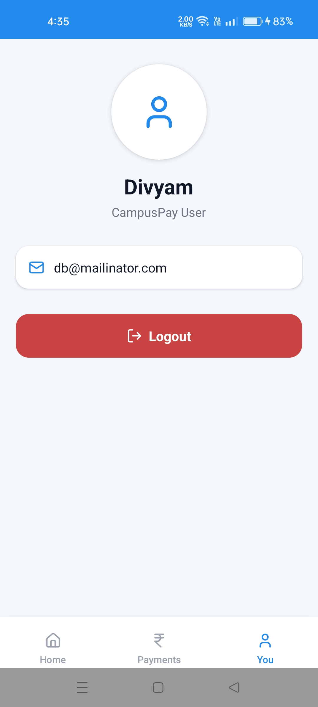

# 🎓 CampusPay

---

<p align="center">
  
  
  
   
  
  
   
  
  
   
   
  
   
   
</p>

<h3 align="center">
Campus Digital Payment Solution
</h3>

<p align="center">
A modern React Native application that simplifies student payments across college campuses through QR-based transactions, secure MPIN verification, and a seamless digital wallet experience.
</p>

<p align="center">
  
  
  
  
</p>

---

# 📖 About CampusPay

CampusPay is a mobile payment solution designed specifically for educational institutions. The application enables students to perform instant digital payments for campus-related services without carrying cash or waiting in long queues.

Inspired by modern UPI applications, CampusPay provides a secure and intuitive payment experience optimized for campus ecosystems.

Students can use the app to:

* Pay Mess Bills
* Purchase from College Canteens
* Pay Hostel Fees
* Pay Transportation Charges
* Make Payments to Campus Vendors
* Track Transaction History
* Manage Wallet Activities
* Secure Transactions using MPIN Verification

---

# ✨ Features

## 🔐 Authentication System

* User Registration
* Secure Login
* Persistent Sessions
* Local User Management

## 💰 Wallet Dashboard

* Wallet Balance Overview
* Quick Actions
* Service Categories
* Recent Transactions

## 📷 QR Scan & Pay

* QR Code Scanner
* UPI Style Payment Flow
* Merchant Detection
* Campus Vendor Payments

## 🔑 MPIN Security

* Create MPIN
* Verify Transactions
* Payment Authorization
* Secure User Flow

## 📜 Transaction History

* Payment Records
* Activity Tracking
* Transaction Categorization
* Detailed Logs

## 🏫 Campus Services

CampusPay supports payments for:

* 🍛 Mess Payments
* 🥤 Canteen Services
* 🚌 Campus Transport
* 🏠 Hostel Facilities
* 📚 College Services
* 🛍 Campus Vendors
* 🎫 Events & Registrations

## 📱 Responsive Mobile Design

* Mobile-First Approach
* Consistent UI Components
* Modern Card-Based Design
* Smooth User Experience

---

# 🏗 Project Architecture

```text
CampusPay
│
├── Authentication
│   ├── Login
│   └── Registration
│
├── Dashboard
│
├── QR Scanner
│
├── MPIN Verification
│
├── Transactions
│
├── Profile
│
└── Local Storage Layer
```

---

# ⚙️ Technology Stack

| Technology          | Usage                  |
| ------------------- | ---------------------- |
| React Native        | Mobile Development     |
| Expo                | Development Framework  |
| Expo Router         | Navigation             |
| TypeScript          | Type Safety            |
| Expo Camera         | QR Scanning            |
| AsyncStorage        | Local Data Persistence |
| Lucide React Native | Icons                  |
| Safe Area Context   | Layout Management      |

---

# 📂 Folder Structure

```text
app/
components/
services/
utils/
assets/
Screenshots/
```

---

# 🚀 Getting Started

### Clone Repository

```bash
git clone https://github.com/your-username/campuspay.git
```

### Navigate to Project

```bash
cd campuspay
```

### Install Dependencies

```bash
npm install
```

### Start Expo Server

```bash
npx expo start
```

### Run Android

```bash
npx expo run:android
```

---

# 💾 Data Persistence

The application uses AsyncStorage for local persistence.

Stored Data:

* User Accounts
* Login Sessions
* MPIN Information
* Wallet Data
* Transaction History

---

# 🎯 Project Objectives

CampusPay was built to demonstrate:

* React Native Development
* Expo Ecosystem Usage
* Mobile UI Design
* QR Scanner Integration
* Secure Transaction Flow
* Local Data Persistence
* State Management
* TypeScript Development

---

# 🔮 Future Improvements

* Backend Integration
* Firebase Authentication
* Real Payment Gateway
* UPI API Integration
* Push Notifications
* College Administration Portal
* Analytics Dashboard
* QR Generation System
* Multi-Campus Support

---

# 👨‍💻 Developer

### DIVYAM BANSAL

Android & React Native Developer.
